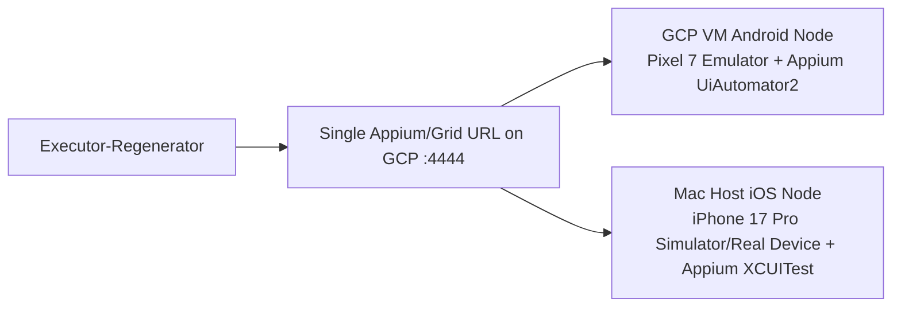

# Local Mobile Execution on GCP for Executor-Regenerator

This document explains how to replace BrowserStack/Sauce execution with your own mobile execution endpoint and then use it from Executor-Regenerator by changing the Appium server URL.

It is intentionally detailed because mobile execution has a few sharp edges: Android emulators are practical on GCP Linux VMs, but iOS execution is different because Appium's iOS driver requires macOS, Xcode, and Apple tooling.

## Quick Answer

For Android Pixel 7:

- Yes, you can host a Pixel 7 Android emulator on a GCP Linux VM.
- Use a Compute Engine VM with nested virtualization enabled.
- Run Android Emulator, Appium, and the UiAutomator2 driver on that VM.
- Executor-Regenerator points `appium_server_url` to that VM.

For iPhone 17 Pro:

- A normal GCP Linux VM cannot run iOS Simulator or XCUITest.
- Appium's XCUITest driver requires macOS and Xcode.
- Apple licensing and tooling require Apple-branded hardware for macOS virtualization.
- Use a Mac host for iOS: on-prem Mac mini, MacStadium, a Mac CI provider, or continue BrowserStack/Sauce for iOS.
- If you want one URL for both Android and iOS, run Selenium Grid on the GCP VM and register:
  - Android Appium node from the GCP VM.
  - iOS Appium node from the Mac host.

Recommended final topology:



If you only need Android, skip Grid and point Executor-Regenerator directly to the GCP Appium server:

```text
http://GCP_VM_IP:4723/wd/hub
```

Current private hosted Appium URL for this setup:

```text
http://34.46.45.187:4723/wd/hub
```

If you need both Pixel 7 and iPhone 17 Pro through one link, point Executor-Regenerator to Selenium Grid:

```text
http://GCP_VM_IP:4444
```

## Important Reality Check

### Android on GCP is feasible

Android Emulator can run on Linux when hardware acceleration/KVM is available. GCP supports nested virtualization for supported Intel-based Compute Engine VMs, which is what the Android Emulator needs for acceptable performance.

Use this for:

- Pixel 7 emulator.
- Android Settings fixture.
- Canva Android app, if you provide a compatible APK or install it on the emulator.
- Any generated Appium script that uses Android-compatible locators.

### iPhone on a normal GCP VM is not feasible

You cannot run iOS Simulator on a standard GCP Linux VM. Appium's XCUITest driver says only macOS is supported as the host platform because it requires Xcode and developer tools. Apple's Xcode page describes Simulator as running "from your Mac", and Apple's macOS license permits macOS virtualization on Apple-branded computers you own/control.

So for iPhone 17 Pro you need one of these:

1. A real iPhone 17 Pro connected by USB to a Mac host.
2. An iPhone 17 Pro simulator on a Mac host with Xcode that includes that simulator runtime.
3. A hosted Mac provider such as MacStadium or equivalent.
4. BrowserStack/Sauce for iOS, while using GCP locally for Android.

The GCP VM can still be the central hub URL. It just cannot be the iOS execution machine.

## Current Working Setup

This is the final Android setup that was actually created after working around GCP capacity and command-line paste issues.

```text
VM name:       mobile-android-appium-01
Machine type:  c3-standard-8
Zone:          us-central1-c
External IP:   34.46.45.187
Appium URL:    http://34.46.45.187:4723/wd/hub
OS:            Ubuntu 24.04 LTS
Nested virt:   Enabled
Device ID:     emulator-5554
AVD:           Pixel-class Android emulator
ADB status:    emulator-5554 device
Boot status:   sys.boot_completed = 1
Appium:        Running on port 4723
Driver:        UiAutomator2
```

The original architecture did not change:

```text
GCP VM -> Android Emulator -> Appium -> Executor-Regenerator uses APPIUM_SERVER_URL
```

The practical changes were:

- Use `c3-standard-8` because `n2-standard-8` had no capacity in the tried `us-central1` zones.
- Use `us-central1-c` because the first zone tried was resource exhausted.
- Remove `--min-cpu-platform="Intel Haswell"` because the selected machine family does not need that setting and GCP may reject stale/minimum CPU platform constraints.
- Use Google Cloud Console Cloud Shell instead of local Windows PowerShell for `gcloud`.
- Use the direct Android command-line-tools Linux zip URL shown below.
- Use an ADB reconnect/check script if the emulator is running but `adb devices` is empty or stale.

## Recommended GCP VM

### Best single Android node VM

Use this if you will run one Pixel 7 emulator at a time.

```text
Machine type: c3-standard-8
vCPU/RAM:     8 vCPU, 32 GB RAM
Disk:         200 GB pd-ssd or hyperdisk-balanced
OS:           Ubuntu 24.04 LTS x86_64
CPU:          Intel, nested virtualization enabled
Network:      Static external IP, firewall restricted to Executor-Regenerator
```

Why this size:

- Android Emulator is CPU and memory heavy.
- Pixel 7 with Google APIs needs enough RAM to boot reliably.
- 8 vCPU/32 GB is a practical starting point.
- Use `c3-standard-16` if you want multiple Android emulators on the same VM.

### Cheaper Android node VM

Use only for light testing or one headless emulator with lower reliability.

```text
Machine type: n2-standard-8
vCPU/RAM:     8 vCPU, 32 GB RAM
Disk:         150-200 GB pd-ssd
OS:           Ubuntu 24.04 LTS x86_64
CPU:          Intel, nested virtualization enabled
```

### Avoid these for Android Emulator

Avoid:

- `e2-*`
- AMD machine families such as `n2d-*`, `c2d-*`, `t2d-*`
- Arm machine families
- memory-optimized families

Reason: GCP nested virtualization restrictions exclude E2, memory-optimized VMs, AMD/Arm-powered VMs, and some other families. Android Emulator performance depends on KVM/VM acceleration.

## GCP Setup

Use Google Cloud Console Cloud Shell for this setup. This avoids installing `gcloud` locally on Windows.

Open:

```text
Google Cloud Console -> Activate Cloud Shell
```

Set variables in Cloud Shell:

```bash
PROJECT_ID="your-gcp-project-id"
ZONE="us-central1-c"
REGION="us-central1"
VM_NAME="mobile-android-appium-01"
```

Set gcloud defaults:

```bash
gcloud config set project "$PROJECT_ID"
gcloud config set compute/zone "$ZONE"
```

Create a static external IP:

```bash
gcloud compute addresses create mobile-appium-ip --region "$REGION"

gcloud compute addresses describe mobile-appium-ip \
  --region "$REGION" \
  --format="value(address)"
```

Create the VM with nested virtualization enabled:

```bash
gcloud compute instances create "$VM_NAME" \
  --zone="$ZONE" \
  --machine-type=c3-standard-8 \
  --image-family=ubuntu-2404-lts-amd64 \
  --image-project=ubuntu-os-cloud \
  --boot-disk-size=200GB \
  --boot-disk-type=pd-ssd \
  --enable-nested-virtualization \
  --tags=mobile-appium-server \
  --address=mobile-appium-ip
```

Do not add `--min-cpu-platform="Intel Haswell"` for this working setup. It was useful in some older nested-virtualization examples, but the final `c3-standard-8` VM worked without it.

If the chosen zone has capacity issues, try another `us-central1` zone first. In this setup, `us-central1-c` worked after other zones were exhausted.

## Firewall Rules

Do not expose Appium to the whole internet. Appium does not provide strong built-in authentication. Restrict source IPs to your Executor-Regenerator server or use VPN/SSH tunneling.

First make sure the VM has the target tag used by the firewall rule:

```bash
gcloud compute instances add-tags mobile-android-appium-01 \
  --zone us-central1-c \
  --tags mobile-appium-server
```

If Cloud Shell prints this, it is OK:

```text
No change requested; skipping update for [mobile-android-appium-01].
```

That means the VM already has the `mobile-appium-server` tag.

For direct Android-only Appium:

```bash
EXECUTOR_PUBLIC_IP="x.x.x.x/32"

gcloud compute firewall-rules create allow-appium-from-executor \
  --allow=tcp:4723 \
  --source-ranges="$EXECUTOR_PUBLIC_IP" \
  --target-tags=mobile-appium-server \
  --description="Allow Executor-Regenerator to reach Appium"
```

If the rule already exists and your laptop/Executor-Regenerator public IP changed, update the existing rule:

```bash
EXECUTOR_PUBLIC_IP="x.x.x.x/32"

gcloud compute firewall-rules update allow-appium-from-executor \
  --source-ranges="$EXECUTOR_PUBLIC_IP"
```

From Windows, get your current public IP with:

```powershell
Invoke-RestMethod https://api.ipify.org
```

For Selenium Grid:

```bash
gcloud compute firewall-rules create allow-grid-from-executor \
  --allow=tcp:4444 \
  --source-ranges="$EXECUTOR_PUBLIC_IP" \
  --target-tags=mobile-appium-server \
  --description="Allow Executor-Regenerator to reach Selenium Grid"
```

For SSH:

```bash
gcloud compute firewall-rules create allow-ssh-from-admin \
  --allow=tcp:22 \
  --source-ranges="$EXECUTOR_PUBLIC_IP" \
  --target-tags=mobile-appium-server
```

## SSH Into the VM

Run this from **Google Cloud Shell** or your local machine with `gcloud` installed:

```bash
gcloud compute ssh mobile-android-appium-01 --zone us-central1-c
```

Do not run `gcloud compute ssh mobile-android-appium-01` from inside `mobile-android-appium-01` itself. If you do, GCP may print:

```text
Request had insufficient authentication scopes.
```

That error is about the VM's own service account permissions and is not related to Appium. Once you are already inside the VM, just run Linux/Appium/ADB commands directly.

All commands below run inside the Ubuntu VM unless stated otherwise.

## Verify Nested Virtualization

Check that VMX is exposed:

```bash
grep -cw vmx /proc/cpuinfo
```

Expected:

```text
greater than 0
```

Check KVM:

```bash
ls -l /dev/kvm
lsmod | grep kvm
```

Expected:

```text
/dev/kvm exists
kvm_intel appears
```

If `/dev/kvm` is missing, stop here. The Android emulator will be too slow or unusable.

## Create a Dedicated User

```bash
sudo useradd -m -s /bin/bash mobile
sudo usermod -aG sudo,kvm mobile
sudo passwd mobile
```

Switch to that user:

```bash
sudo su - mobile
```

## Install System Dependencies

```bash
sudo apt update
sudo apt install -y \
  openjdk-17-jdk \
  curl wget unzip git jq \
  qemu-kvm libvirt-daemon-system libvirt-clients bridge-utils \
  xvfb socat net-tools lsof \
  mesa-utils libnss3 libxcomposite1 libxcursor1 libxi6 libxtst6 \
  libxrandr2 libasound2t64 libatk1.0-0 libatk-bridge2.0-0 \
  libcups2 libdrm2 libgbm1 libxdamage1 libxfixes3
```

Confirm Java:

```bash
java -version
```

## Install Node.js and Appium

Install Node.js 20 LTS:

```bash
curl -fsSL https://deb.nodesource.com/setup_20.x | sudo -E bash -
sudo apt install -y nodejs
node -v
npm -v
```

Install Appium:

```bash
sudo npm install -g appium
appium -v
```

Install Android UiAutomator2 driver:

```bash
appium driver install uiautomator2
appium driver list --installed
```

Expected:

```text
uiautomator2 installed
```

## Install Android SDK Command Line Tools

Create SDK folders:

```bash
export ANDROID_HOME=/opt/android-sdk
export ANDROID_SDK_ROOT=/opt/android-sdk
sudo mkdir -p $ANDROID_HOME/cmdline-tools
sudo chown -R mobile:mobile $ANDROID_HOME
```

Download Android command line tools. The working Linux command-line-tools URL used in this setup was:

```bash
cd /tmp
wget -O commandlinetools-linux.zip "https://dl.google.com/android/repository/commandlinetools-linux-14742923_latest.zip"
unzip commandlinetools-linux.zip
mkdir -p $ANDROID_HOME/cmdline-tools/latest
mv cmdline-tools/* $ANDROID_HOME/cmdline-tools/latest/
```

If Google publishes a newer tools package and this URL stops working, get the current Linux command-line-tools URL from:

```text
https://developer.android.com/studio#command-line-tools-only
```

Add environment variables:

```bash
cat <<'EOF' >> ~/.bashrc

export ANDROID_HOME=/opt/android-sdk
export ANDROID_SDK_ROOT=/opt/android-sdk
export PATH=$ANDROID_HOME/cmdline-tools/latest/bin:$ANDROID_HOME/platform-tools:$ANDROID_HOME/emulator:$PATH
EOF

source ~/.bashrc
```

Accept licenses:

```bash
yes | sdkmanager --licenses
```

Install Android packages. Use API 36 if available; otherwise pick the latest stable x86_64 Google APIs image from `sdkmanager --list`.

```bash
sdkmanager \
  "platform-tools" \
  "emulator" \
  "platforms;android-36" \
  "system-images;android-36;google_apis;x86_64"
```

If the API 36 image is unavailable:

```bash
sdkmanager --list | grep "system-images" | grep "google_apis" | grep "x86_64"
```

Then install the available API, for example:

```bash
sdkmanager \
  "platform-tools" \
  "emulator" \
  "platforms;android-35" \
  "system-images;android-35;google_apis;x86_64"
```

## Create a Pixel 7 AVD

List device profiles:

```bash
avdmanager list device | grep -i "pixel"
```

Create Pixel 7:

```bash
avdmanager create avd \
  -n Pixel_7_API_36 \
  -k "system-images;android-36;google_apis;x86_64" \
  -d "pixel_7" \
  --force
```

If `pixel_7` is not available on your command line tools version, use the closest Pixel profile:

```bash
avdmanager create avd \
  -n Pixel_7_API_36 \
  -k "system-images;android-36;google_apis;x86_64" \
  -d "pixel_6" \
  --force
```

This is still a Pixel-class Android emulator. Appium will care mainly about `udid`, platform, package/activity, and UI state.

## Start the Pixel 7 Emulator Headlessly

Start the emulator:

```bash
emulator -avd Pixel_7_API_36 \
  -no-window \
  -no-audio \
  -no-boot-anim \
  -gpu swiftshader_indirect \
  -accel on \
  -netdelay none \
  -netspeed full \
  -camera-back none \
  -camera-front none
```

In another SSH terminal:

```bash
adb wait-for-device
adb devices
adb shell getprop sys.boot_completed
```

Expected:

```text
emulator-5554    device
1
```

If the emulator is running but `adb devices` shows nothing, reconnect ADB:

```bash
adb kill-server
adb start-server
adb devices -l
adb -s emulator-5554 shell getprop sys.boot_completed
```

Expected final state:

```text
emulator-5554 device
1
```

If multiline paste is unreliable in Cloud Shell or SSH, create a temporary check script:

```bash
cat >/tmp/adb-check.sh <<'EOF'
#!/usr/bin/env bash
set -euo pipefail

export ANDROID_HOME=/opt/android-sdk
export ANDROID_SDK_ROOT=/opt/android-sdk
export PATH="$ANDROID_HOME/platform-tools:$ANDROID_HOME/emulator:$ANDROID_HOME/cmdline-tools/latest/bin:$PATH"

adb kill-server
adb start-server
adb devices -l
adb -s emulator-5554 shell getprop sys.boot_completed
EOF

chmod +x /tmp/adb-check.sh
/tmp/adb-check.sh
```

Disable animations:

```bash
adb shell settings put global window_animation_scale 0
adb shell settings put global transition_animation_scale 0
adb shell settings put global animator_duration_scale 0
```

Check emulator acceleration:

```bash
emulator -accel-check
```

Expected:

```text
accel:
0
KVM is installed and usable
```

## Install or Prepare the Canva App on Android

For stable automation, prefer an APK you control. Public Play Store installs on headless emulators are fragile because they require Google account login and Play Store state.

Upload your APK:

From Cloud Shell, upload from your Cloud Shell filesystem:

```bash
gcloud compute scp /path/to/canva.apk mobile-android-appium-01:/home/mobile/canva.apk --zone us-central1-c
```

From local Windows PowerShell, if you have local `gcloud` installed:

```powershell
gcloud compute scp D:\path\to\canva.apk mobile-android-appium-01:/home/mobile/canva.apk --zone us-central1-c
```

Install it:

```bash
adb install -r /home/mobile/canva.apk
```

Find package/activity:

```bash
adb shell pm list packages | grep -i canva
adb shell cmd package resolve-activity --brief com.canva.editor
```

Typical package is:

```text
com.canva.editor
```

The launch activity must be copied from your actual APK/device output.

If the APK contains only ARM64 native libraries, it may not run on an x86_64 emulator. In that case use:

- An x86_64-compatible APK build.
- A real Android device lab.
- BrowserStack/Sauce for that app.

## Start Appium Directly

Start Appium:

```bash
appium \
  --address 0.0.0.0 \
  --port 4723 \
  --base-path /wd/hub \
  --log /home/mobile/appium-android.log
```

Check status:

```bash
curl http://127.0.0.1:4723/wd/hub/status
```

Expected:

```json
{
  "value": {
    "ready": true
  }
}
```

External URL for Executor-Regenerator:

```text
http://34.46.45.187:4723/wd/hub
```

## Run Appium and Emulator as systemd Services

Create emulator service:

```bash
sudo tee /etc/systemd/system/android-emulator.service > /dev/null <<'EOF'
[Unit]
Description=Android Pixel 7 Emulator
After=network-online.target
Wants=network-online.target

[Service]
Type=simple
User=mobile
Environment=ANDROID_HOME=/opt/android-sdk
Environment=ANDROID_SDK_ROOT=/opt/android-sdk
Environment=PATH=/opt/android-sdk/cmdline-tools/latest/bin:/opt/android-sdk/platform-tools:/opt/android-sdk/emulator:/usr/local/bin:/usr/bin:/bin
ExecStart=/opt/android-sdk/emulator/emulator -avd Pixel_7_API_36 -no-window -no-audio -no-boot-anim -gpu swiftshader_indirect -accel on -netdelay none -netspeed full -camera-back none -camera-front none
Restart=always
RestartSec=10

[Install]
WantedBy=multi-user.target
EOF
```

Create Appium service:

```bash
sudo tee /etc/systemd/system/appium-android.service > /dev/null <<'EOF'
[Unit]
Description=Appium Android Server
After=network-online.target android-emulator.service
Wants=network-online.target android-emulator.service

[Service]
Type=simple
User=mobile
Environment=ANDROID_HOME=/opt/android-sdk
Environment=ANDROID_SDK_ROOT=/opt/android-sdk
Environment=PATH=/opt/android-sdk/cmdline-tools/latest/bin:/opt/android-sdk/platform-tools:/opt/android-sdk/emulator:/usr/local/bin:/usr/bin:/bin
ExecStart=/usr/bin/appium --address 0.0.0.0 --port 4723 --base-path /wd/hub --log /home/mobile/appium-android.log
Restart=always
RestartSec=5

[Install]
WantedBy=multi-user.target
EOF
```

Enable services:

```bash
sudo systemctl daemon-reload
sudo systemctl enable android-emulator.service
sudo systemctl enable appium-android.service
sudo systemctl start android-emulator.service
sleep 60
sudo systemctl start appium-android.service
```

Check:

```bash
sudo systemctl status android-emulator.service
sudo systemctl status appium-android.service
adb devices
curl http://127.0.0.1:4723/wd/hub/status
```

Logs:

```bash
journalctl -u android-emulator.service -f
journalctl -u appium-android.service -f
tail -f /home/mobile/appium-android.log
```

## Executor-Regenerator Integration: Android Direct URL

If you only run Android Pixel 7 from GCP, use direct Appium.

PowerShell:

```powershell
$appiumUrl = "http://34.46.45.187:4723/wd/hub"

$matrix = @'
{
  "devices": [
    {
      "label": "Pixel 7 Local GCP",
      "slug": "pixel_7_local_gcp",
      "device_name": "Pixel_7_API_36",
      "platform_name": "Android",
      "platform_version": "16",
      "udid": "emulator-5554",
      "app_package": "com.canva.editor",
      "app_activity": "REPLACE_WITH_REAL_CANVA_ACTIVITY",
      "no_reset": true,
      "relaunch_before_test": true,
      "relaunch_before_step_retry": true
    }
  ]
}
'@

curl.exe -X POST "http://127.0.0.1:8000/executor/appium/run" `
  -H "X-API-Key: client_sec_key" `
  -F "script=@D:\path\to\generated_appium.py" `
  -F "appium_server_url=$appiumUrl" `
  -F "appium_device_matrix=$matrix" `
  --output local-pixel7-result.zip
```

If the app is already installed and launchable, `app_package` and `app_activity` are enough. If you want Appium to install an APK per run, add:

```json
"app": "/absolute/path/on/gcp/vm/canva.apk"
```

But for remote Appium, that path is on the GCP Appium server, not on the Executor-Regenerator machine.

## Can We Use It By Just Changing the Link?

Yes, with one important condition.

Changing only this:

```text
BrowserStack/Appium provider URL -> http://34.46.45.187:4723/wd/hub
```

is enough only if the capabilities are already local-Appium-compatible.

BrowserStack capabilities are not local-compatible:

```json
{
  "appium:app": "bs://APP_ID",
  "bstack:options": {}
}
```

Local GCP Appium capabilities should look like:

```json
{
  "platformName": "Android",
  "appium:automationName": "UiAutomator2",
  "appium:deviceName": "Pixel_7_API_36",
  "appium:udid": "emulator-5554",
  "appium:appPackage": "com.canva.editor",
  "appium:appActivity": "REPLACE_WITH_REAL_CANVA_ACTIVITY",
  "appium:noReset": true
}
```

Best workflow:

1. Put the local matrix into Executor-Regenerator `.env` as `APPIUM_DEVICE_MATRIX_JSON`.
2. Then your API call only needs the generated script and the server URL.
3. To move between BrowserStack and local, switch `appium_server_url` plus the matrix preset.

If you truly want to change only one field at request time, set up Selenium Grid and keep a stable local/default matrix in `.env`.

## iPhone 17 Pro Setup

This must happen on a Mac host, not the GCP Linux VM.

### Mac host recommendation

For one iPhone simulator/device:

```text
Hardware: Mac mini M4/M4 Pro or Mac Studio
RAM:      24 GB minimum, 32 GB+ recommended
Disk:     512 GB minimum
OS:       Current macOS supported by your Xcode version
Xcode:    Version that includes iPhone 17 Pro / desired iOS runtime
Network:  VPN or private tunnel to GCP Grid VM
```

For a real iPhone 17 Pro:

- Connect the device to the Mac by USB.
- Trust the Mac on the iPhone.
- Enable Developer Mode on the iPhone.
- Use an Apple Developer account for WebDriverAgent signing.

For simulator:

- Install Xcode.
- Install the iOS simulator runtime.
- Confirm the exact simulator name exists:

```bash
xcrun simctl list devicetypes | grep -i "iPhone 17"
xcrun simctl list runtimes | grep -i iOS
```

If Xcode does not list `iPhone 17 Pro`, use the exact available device name, for example `iPhone 16 Pro` or whatever Xcode reports.

### Install Appium on the Mac

```bash
brew install node
npm install -g appium
appium driver install xcuitest
appium driver list --installed
```

Check Xcode command line tools:

```bash
xcode-select -p
xcodebuild -version
```

Run Appium XCUITest doctor if available:

```bash
appium driver doctor xcuitest
```

Start iOS Appium:

```bash
appium \
  --address 0.0.0.0 \
  --port 4725 \
  --base-path /wd/hub \
  --log ~/appium-ios.log
```

Status:

```bash
curl http://127.0.0.1:4725/wd/hub/status
```

### iOS runtime capabilities

Simulator example:

```json
{
  "label": "iPhone 17 Pro Local Mac",
  "slug": "iphone_17_pro_local_mac",
  "device_name": "iPhone 17 Pro",
  "platform_name": "iOS",
  "platform_version": "REPLACE_WITH_IOS_VERSION",
  "bundle_id": "com.canva.editor",
  "no_reset": true,
  "extra_capabilities": {
    "appium:automationName": "XCUITest"
  }
}
```

Real device example:

```json
{
  "label": "iPhone 17 Pro Real Device",
  "slug": "iphone_17_pro_real",
  "device_name": "iPhone 17 Pro",
  "platform_name": "iOS",
  "platform_version": "REPLACE_WITH_IOS_VERSION",
  "udid": "REPLACE_WITH_REAL_DEVICE_UDID",
  "bundle_id": "com.canva.editor",
  "no_reset": true,
  "extra_capabilities": {
    "appium:automationName": "XCUITest",
    "appium:xcodeOrgId": "REPLACE_TEAM_ID",
    "appium:xcodeSigningId": "iPhone Developer",
    "appium:updatedWDABundleId": "com.yourcompany.WebDriverAgentRunner"
  }
}
```

## One URL for Android and iPhone: Selenium Grid

Use this when Executor-Regenerator must hit one link and route Pixel 7 and iPhone 17 Pro automatically.

The GCP VM runs:

- Selenium Grid hub on `:4444`.
- Android Appium server on `:4723`.
- Selenium Grid node for the Android Appium server.

The Mac host runs:

- iOS Appium server on `:4725`.
- Selenium Grid node for the iOS Appium server.

Executor-Regenerator uses:

```text
http://GCP_EXTERNAL_IP:4444
```

### Install Selenium Server on GCP VM

On the GCP VM:

```bash
mkdir -p ~/selenium
cd ~/selenium
SELENIUM_JAR_URL="$(curl -s https://api.github.com/repos/SeleniumHQ/selenium/releases/latest \
  | jq -r '.assets[].browser_download_url' \
  | grep -E 'selenium-server-[0-9].*\.jar$' \
  | head -n 1)"
wget -O selenium-server.jar "$SELENIUM_JAR_URL"
```

If the API command fails, download the Selenium Server jar manually from:

```text
https://github.com/SeleniumHQ/selenium/releases
```

Start Grid hub:

```bash
java -jar ~/selenium/selenium-server.jar hub --host 0.0.0.0 --port 4444
```

Grid console:

```text
http://GCP_EXTERNAL_IP:4444/ui
```

### Android node config on GCP

Create:

```bash
mkdir -p ~/selenium/nodes
cat > ~/selenium/nodes/android-pixel7.toml <<'EOF'
[server]
port = 5555

[node]
detect-drivers = false

[relay]
url = "http://127.0.0.1:4723/wd/hub"
status-endpoint = "/status"
configs = [
  "1", "{\"platformName\":\"Android\",\"appium:automationName\":\"UiAutomator2\",\"appium:deviceName\":\"Pixel_7_API_36\",\"appium:udid\":\"emulator-5554\"}"
]
EOF
```

Start Android node:

```bash
java -jar ~/selenium/selenium-server.jar node \
  --config ~/selenium/nodes/android-pixel7.toml \
  --hub http://127.0.0.1:4444
```

### iOS node config on Mac

The Mac must be able to reach the GCP Grid hub. Use Cloud VPN, Tailscale, WireGuard, or a locked-down firewall rule.

The GCP Grid hub must also be able to reach the Mac node HTTP endpoint. In practice, use one of these:

- Put the Mac and GCP VM on the same VPN/mesh network.
- Expose the Mac node port only to the GCP VM public IP.
- Use a reverse tunnel from the Mac to the GCP VM if the Mac is behind NAT.

Create on Mac:

```bash
mkdir -p ~/selenium/nodes
cat > ~/selenium/nodes/ios-iphone17pro.toml <<'EOF'
[server]
port = 5565

[node]
detect-drivers = false

[relay]
url = "http://127.0.0.1:4725/wd/hub"
status-endpoint = "/status"
configs = [
  "1", "{\"platformName\":\"iOS\",\"appium:automationName\":\"XCUITest\",\"appium:deviceName\":\"iPhone 17 Pro\"}"
]
EOF
```

Start iOS node on Mac:

```bash
java -jar ~/selenium/selenium-server.jar node \
  --config ~/selenium/nodes/ios-iphone17pro.toml \
  --hub http://GCP_EXTERNAL_IP:4444
```

### Matrix for Executor-Regenerator through Grid

Use one `appium_server_url`:

```powershell
$gridUrl = "http://GCP_EXTERNAL_IP:4444"
```

Use runtime matrix:

```powershell
$matrix = @'
{
  "devices": [
    {
      "label": "Pixel 7 Local GCP",
      "slug": "pixel_7_local_gcp",
      "device_name": "Pixel_7_API_36",
      "platform_name": "Android",
      "platform_version": "16",
      "udid": "emulator-5554",
      "app_package": "com.canva.editor",
      "app_activity": "REPLACE_WITH_REAL_CANVA_ACTIVITY",
      "no_reset": true,
      "relaunch_before_test": true,
      "relaunch_before_step_retry": true,
      "extra_capabilities": {
        "appium:automationName": "UiAutomator2"
      }
    },
    {
      "label": "iPhone 17 Pro Local Mac",
      "slug": "iphone_17_pro_local_mac",
      "device_name": "iPhone 17 Pro",
      "platform_name": "iOS",
      "platform_version": "REPLACE_WITH_IOS_VERSION",
      "bundle_id": "com.canva.editor",
      "no_reset": true,
      "relaunch_before_test": true,
      "relaunch_before_step_retry": true,
      "extra_capabilities": {
        "appium:automationName": "XCUITest"
      }
    }
  ]
}
'@

curl.exe -X POST "http://127.0.0.1:8000/executor/appium/run" `
  -H "X-API-Key: client_sec_key" `
  -F "script=@D:\path\to\generated_appium.py" `
  -F "appium_server_url=$gridUrl" `
  -F "appium_device_matrix=$matrix" `
  --output local-mobile-matrix-result.zip
```

Executor-Regenerator will run each selected device one after another. The output ZIP will contain:

```text
matrix_summary.json
pixel_7_local_gcp/
  status.txt
  final_script.py
  success/
  failures/
iphone_17_pro_local_mac/
  status.txt
  final_script.py
  success/
  failures/
```

## `.env` Preset for Executor-Regenerator

For the current Android-only hosted Appium server, use this in `Executor-Regenrator/.env`:

```env
ENABLE_APPIUM_EXECUTION=true
APPIUM_SERVER_URL=http://34.46.45.187:4723/wd/hub
```

Executor-Regenerator already has this value configured in the local `.env`. Restart Executor-Regenerator after changing it so the process reloads the environment.

If you later switch to the optional Android+iOS Selenium Grid design and want the API call to only change the URL, place the matrix in `Executor-Regenrator/.env`:

```env
ENABLE_APPIUM_EXECUTION=true
APPIUM_SERVER_URL=http://GCP_EXTERNAL_IP:4444
APPIUM_DEVICE_MATRIX_JSON={"devices":[{"label":"Pixel 7 Local GCP","slug":"pixel_7_local_gcp","device_name":"Pixel_7_API_36","platform_name":"Android","platform_version":"16","udid":"emulator-5554","app_package":"com.canva.editor","app_activity":"REPLACE_WITH_REAL_CANVA_ACTIVITY","no_reset":true,"relaunch_before_test":true,"relaunch_before_step_retry":true,"extra_capabilities":{"appium:automationName":"UiAutomator2"}},{"label":"iPhone 17 Pro Local Mac","slug":"iphone_17_pro_local_mac","device_name":"iPhone 17 Pro","platform_name":"iOS","platform_version":"REPLACE_WITH_IOS_VERSION","bundle_id":"com.canva.editor","no_reset":true,"relaunch_before_test":true,"relaunch_before_step_retry":true,"extra_capabilities":{"appium:automationName":"XCUITest"}}]}
```

Then call Executor-Regenerator:

```powershell
curl.exe -X POST "http://127.0.0.1:8000/executor/appium/run" `
  -H "X-API-Key: client_sec_key" `
  -F "script=@D:\path\to\generated_appium.py" `
  -F "appium_server_url=http://GCP_EXTERNAL_IP:4444" `
  --output local-mobile-matrix-result.zip
```

This is the closest version of "just change the link."

If you pass `appium_device_matrix` in the request, that request value overrides the need for `.env`.

## Health Check Checklist

On GCP Android VM:

```bash
grep -cw vmx /proc/cpuinfo
ls -l /dev/kvm
adb devices
ss -lntp | grep 4723
curl http://127.0.0.1:4723/wd/hub/status
```

Expected Appium status from inside the VM:

```json
{"value":{"ready":true,"message":"The server is ready to accept new connections","build":{"version":"3.5.0"}}}
```

On Mac iOS host:

```bash
xcodebuild -version
xcrun simctl list devices available | grep -i "iPhone"
curl http://127.0.0.1:4725/wd/hub/status
```

On Grid hub:

```bash
curl http://127.0.0.1:4444/status
```

From Executor-Regenerator machine:

```powershell
curl.exe http://GCP_EXTERNAL_IP:4444/status
```

or direct Android:

```powershell
curl.exe http://34.46.45.187:4723/wd/hub/status
```

## Troubleshooting

### `/dev/kvm` missing

Cause:

- Nested virtualization not enabled.
- Unsupported machine family.
- AMD/Arm/E2 machine.

Fix:

- Recreate VM with `--enable-nested-virtualization`.
- Use the known-working `c3-standard-8` setup in `us-central1-c`, or another Intel machine family/zone with nested virtualization capacity.

### Emulator boots but Appium cannot find device

Check:

```bash
adb devices
adb kill-server
adb start-server
adb wait-for-device
```

Use `udid: emulator-5554` in capabilities.

### Executor-Regenerator times out connecting to Appium

Symptom in `failed_runs/<run_id>/failures/summary.json`:

```text
startup_error: HTTPConnectionPool(host='34.46.45.187', port=4723): Max retries exceeded with url: /wd/hub/session
Connection to 34.46.45.187 timed out
failed_step_index: null
steps: []
```

Meaning:

- The script did not reach step 1.
- Executor-Regenerator failed while creating the Appium WebDriver session.
- This is a network/Appium exposure problem, not a script locator problem.

First check from inside the VM:

```bash
curl http://127.0.0.1:4723/wd/hub/status
ss -lntp | grep 4723
```

If localhost status returns `ready: true`, Appium is running.

Then inspect the listener:

```text
127.0.0.1:4723
```

means Appium is only reachable inside the VM. Restart it with `0.0.0.0`:

```bash
appium --address 0.0.0.0 --port 4723 --base-path /wd/hub
```

For systemd, the service should contain:

```bash
ExecStart=/usr/bin/appium --address 0.0.0.0 --port 4723 --base-path /wd/hub --log /home/mobile/appium-android.log
```

Reload/restart:

```bash
sudo systemctl daemon-reload
sudo systemctl restart appium-android.service
sudo systemctl status appium-android.service --no-pager
```

If the listener is already:

```text
0.0.0.0:4723
```

but Windows still times out, fix GCP firewall from Cloud Shell:

```bash
gcloud compute instances add-tags mobile-android-appium-01 \
  --zone us-central1-c \
  --tags mobile-appium-server
```

`No change requested` is fine; it means the tag already exists.

Then create or update the firewall rule:

```bash
MY_IP="YOUR_WINDOWS_PUBLIC_IP/32"

gcloud compute firewall-rules create allow-appium-from-executor \
  --allow=tcp:4723 \
  --source-ranges="$MY_IP" \
  --target-tags=mobile-appium-server \
  --description="Allow Executor-Regenerator to reach Appium"
```

If it already exists:

```bash
gcloud compute firewall-rules update allow-appium-from-executor \
  --source-ranges="$MY_IP"
```

Test from Windows:

```powershell
curl.exe http://34.46.45.187:4723/wd/hub/status
```

Do not retry Swagger until this returns `ready: true` from Windows.

### Canva does not install

Possible causes:

- APK is not compatible with x86_64 emulator.
- APK requires Google Play services.
- APK is split APK/AAB rather than a single APK.

Fix:

- Use a universal APK or x86_64-compatible APK.
- Use an emulator image with Google APIs/Play support if needed.
- Use a real Android device if app compatibility is strict.

### iPhone node never appears in Grid

Cause:

- Mac cannot reach GCP hub.
- Firewall blocks Grid.
- Selenium node config points to wrong Appium URL.

Fix:

```bash
curl http://GCP_EXTERNAL_IP:4444/status
curl http://127.0.0.1:4725/wd/hub/status
```

Then restart the Mac Selenium node.

### iOS session fails before app opens

Common causes:

- Xcode version does not support selected iOS/device runtime.
- `device_name` does not exactly match Xcode simulator/device name.
- Wrong `bundle_id`.
- WebDriverAgent signing issue on real device.
- Real iPhone not trusted or Developer Mode disabled.

### Executor-Regenerator still hits BrowserStack

Check the request:

```powershell
-F "appium_server_url=http://GCP_EXTERNAL_IP:4444"
```

Check `.env`:

```env
APPIUM_SERVER_URL=http://GCP_EXTERNAL_IP:4444
```

Restart Executor-Regenerator after `.env` changes.

## Security Notes

Do not expose these ports publicly without restrictions:

- `4723` Appium Android
- `4725` Appium iOS
- `4444` Selenium Grid

Recommended:

- Restrict firewall source to Executor-Regenerator IP.
- Use private networking/VPN where possible.
- Do not put Appium open on `0.0.0.0` to the whole internet.
- Rotate any API keys in Executor-Regenerator.
- Avoid embedding secrets in generated scripts or fixtures.

## When to Keep BrowserStack/Sauce

Keep BrowserStack/Sauce if:

- You need real iPhone devices but do not have a Mac/device lab.
- You need many Android/iOS versions.
- You need reliable public Canva app installation without managing APKs.
- You need provider-side logs, videos, and device inventory.
- You need scale/parallelism beyond one or two local devices.

Use local GCP/Appium if:

- You want lower per-run dependency on BrowserStack.
- You control the APK/IPA.
- You need repeatable debugging on one Pixel 7 emulator.
- You can provide a Mac node for iOS.

## References

- Google Cloud nested virtualization overview: https://docs.cloud.google.com/compute/docs/instances/nested-virtualization/overview
- Google Cloud enable nested virtualization: https://docs.cloud.google.com/compute/docs/instances/nested-virtualization/enabling
- Android Emulator hardware acceleration: https://developer.android.com/studio/run/emulator-acceleration
- Appium UiAutomator2 driver: https://appium.io/docs/en/3.4/quickstart/uiauto2-driver/
- Appium and Selenium Grid: https://appium.io/docs/en/2.0/guides/grid/
- Appium XCUITest driver host requirement: https://github.com/appium/appium-xcuitest-driver
- Apple Xcode Simulator overview: https://developer.apple.com/xcode/
- Apple macOS software license: https://www.apple.com/legal/sla/
