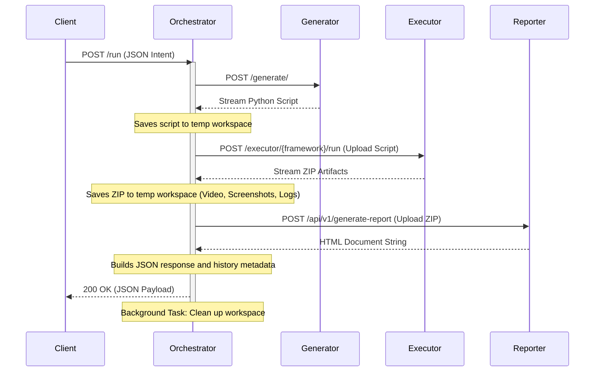

# Automation Orchestrator Microservice

> **Created by:** Mokshith Balidi  
> **Created in:** January 2026  
> **Organization:** TW.2324  
> **Rights:** Mokshith Balidi holds all rights to this microservice.

---

A highly concurrent, production-ready **FastAPI** orchestrator that acts as the central nervous system for the AI-Powered Self-Healing Test Automation Platform. 

It manages the end-to-end lifecycle of a test execution by coordinating between the **Script Generator**, the **Executor/Self-Healing engine**, and the **Artifact Reporter**, providing a single robust entry point for your CI/CD pipelines.

---

## 🌟 Key Features

- **FastAPI Core:** Built entirely on modern FastAPI, leveraging asynchronous `async/await` patterns, Pydantic data validation, and automatic OpenAPI (Swagger) documentation.
- **Enterprise Resilience (Circuit Breaker):** Features an in-memory Circuit Breaker pattern with exponential backoff and jitter. If a downstream service goes offline, the circuit trips to prevent cascading network failures and returns `503 Service Unavailable` immediately.
- **High Concurrency Pipeline:** Built on `asyncio` and `httpx` with active concurrency semaphores to gracefully throttle load dynamically and limit simultaneous runs.
- **Memory-Efficient Streaming:** Streams massive files (like generated Python scripts and 50MB+ ZIP artifacts containing execution videos) directly to and from a local disk workspace, maintaining an ultra-low application memory footprint.
- **Observability Built-In:** Exposes detailed Prometheus metrics (`/metrics`) and strictly injects correlation `X-Request-ID` headers across all structured logs and downstream HTTP calls.
- **Structured Appium Compatibility:** Accepts Appium generation defaults (`appium_config`) alongside optional runtime overrides (`appium_server_url`, `appium_device_filter`, `appium_device_matrix`) while preserving backward compatibility for existing `/run` clients.
- **Structured Pipeline Response:** Returns a single JSON payload that includes routing decisions, executor metadata, report linkage, and downstream sync status.

---

## 🏛️ Architecture & Workflow

When a test case specification is submitted to the `/run` endpoint, the Orchestrator performs the following lifecycle:



---

## 🚀 Quick Start

### Installation

```bash
# Clone or navigate to the directory
cd Orchestrator

# Create virtual environment
python -m venv venv
venv\Scripts\activate  # Windows
# source venv/bin/activate  # Linux/Mac

# Install dependencies
pip install -r requirements.txt
```

### Configuration

Create a `.env` file in the root directory. The Orchestrator uses `pydantic-settings` to strictly validate these variables at startup.

```env
# Downstream Services
GENERATOR_URL="http://127.0.0.1:8001"
GENERATOR_API_KEY="your_generator_key"

EXECUTOR_URL="http://127.0.0.1:8003"
EXECUTOR_API_KEY="your_executor_key"

REPORTER_URL="http://127.0.0.1:8002"
REPORTER_API_KEY="your_reporter_key"

# Operational Knobs
MAX_CONCURRENT_RUNS=5
DOWNSTREAM_TIMEOUT_SECONDS=900
MAX_GENERATOR_BYTES=4000000
MAX_EXECUTOR_ZIP_BYTES=90000000

# Resilience configuration
RETRY_ATTEMPTS=3
RETRY_BACKOFF_BASE=0.5
CIRCUIT_BREAKER_FAILURE_THRESHOLD=7
CIRCUIT_BREAKER_COOLDOWN=60

# Standard Server Config
PORT=8080
LOG_LEVEL=INFO
```

### Running the Server

Because it is a FastAPI service, you can run it via the custom wrapper script:

```bash
# Run the server via Uvicorn
python run.py
```

The OpenAPI documentation will be automatically available at:
- Swagger UI: `http://localhost:8080/docs`
- ReDoc: `http://localhost:8080/redoc`

---

## 📖 API Documentation

### 1. Run Pipeline
`POST /run`

Accepts a direct test case JSON payload. The public request shape remains backward compatible, while the Orchestrator now wraps that payload internally before calling Generator as:

```json
{
  "test_case": { "...": "generator-compatible testcase" },
  "webhook_url": "https://optional-generation-webhook.example"
}
```

**Headers Required (Optional if configured):**
- `X-API-Key`: If `GENERATOR_API_KEY` is set, this is used for basic endpoint protection.

**Request Body Example:**
```json
{
  "test_case_id": "TC001",
  "description": "Login test",
  "target_framework": "playwright",
  "webhook_url": "https://hooks.example.test/generator",
  "steps": [
    {
      "step_id": "STEP_01",
      "description": "Navigate to login page",
      "expected_outcome": "Login page is visible"
    }
  ]
}
```

**Appium Fields:**
- `appium_config`: Optional Appium generation defaults. Valid only when `target_framework="appium"`. Supports camelCase aliases such as `deviceName`, `platformName`, and `extraCapabilities`.
- `appium_server_url`: Optional runtime override sent only to Executor.
- `appium_device_filter`: Optional runtime device selection sent only to Executor.
- `appium_device_matrix`: Optional runtime matrix payload sent only to Executor. If omitted and `appium_config.devices` exists, Orchestrator derives the matrix automatically.

**Response (`application/json`):**
```json
{
  "status": "success",
  "routing_path": "new_generated",
  "matched_probability": null,
  "canonical_testcase_id": "tc-123",
  "testcase_id": "tc-123",
  "report_id": "report-123",
  "executor_status": "passed",
  "executor_run_id": "run-123",
  "executor_duration": "1250",
  "executor_artifact_kind": "single_run",
  "executor_matrix_run_count": null,
  "executor_failed_step_index": null,
  "testcase_rag_status": "ingested",
  "methods_rag_status": "uploaded",
  "duration": 4.82
}
```

For Appium matrix runs, `executor_artifact_kind` is typically `appium_device_matrix` and `executor_matrix_run_count` is populated from Executor response metadata and stored execution history.

### 2. Rerun Existing Testcase
`POST /testcase/{id}/run`

Fetches the testcase from TestCasesRAG and reruns it through the same pipeline. When a testcase document includes `structured_test_case`, Orchestrator prefers that snapshot so Appium settings, matched-script references, and runtime overrides round-trip without lossy string parsing. Legacy records still fall back to reparsing flattened `Steps` and `Pre-requisites`.

### 3. Observability & Health

- **`GET /health`**
  - Basic liveness probe. Returns `200 OK` if the FastAPI process is alive.
  
- **`GET /ready`**
  - Deep readiness probe. Returns `200 OK` if the asynchronous `httpx` client is initialized AND all downstream circuit breakers are currently `CLOSED` (healthy). Returns `503` otherwise.
  
- **`GET /metrics`**
  - Prometheus scrape endpoint. Tracks:
    - `orchestrator_requests_total`: Total run requests by status.
    - `orchestrator_request_duration_seconds`: Histogram of run durations.
    - `orchestrator_downstream_retries_total`: Retries triggered by exponential backoff.
    - `orchestrator_downstream_failures_total`: Total circuit-breaker trips.

---

## 📂 Modular Directory Structure

The monolith has been deconstructed into an enterprise-grade `app/` package:

```text
Orchestrator/
├── app/
│   ├── core/
│   │   ├── config.py         # Pydantic Settings management (.env validation)
│   │   ├── logging.py        # Safe formatters and ContextAdapters for request_id
│   │   ├── metrics.py        # Prometheus counters/histograms
│   │   └── resilience.py     # Circuit breaker and retry-with-backoff logic
│   ├── models/
│   │   └── schemas.py        # API schemas (TestCase, Steps) for FastAPI validation
│   ├── routes/
│   │   ├── health.py         # /health and /ready endpoints
│   │   ├── metrics.py        # /metrics endpoint
│   │   └── orchestrator.py   # /run and /testcase/{id}/run pipeline endpoints
│   ├── services/
│   │   └── http_client.py    # Async HTTPX Client lifecycle management
│   └── main.py               # FastAPI App initialization & Middleware
├── tests/                    # Pytest suite
│   ├── test_health.py        # Lifecycle and probe validation
│   └── test_orchestrator.py  # Model validation and auth tests
├── .env                      # Environment configuration
├── requirements.txt          # Python dependencies
└── run.py                    # Uvicorn server startup script
```

---

## 🧪 Testing

The microservice includes a robust `pytest` suite ensuring lifecycle events, route configurations, and endpoint validations operate correctly.

```bash
# Run tests with asyncio support
pytest tests/ -v
```

This will automatically execute the test suite, mocking the HTTP client lifecycles and validating the `TestClient` FastAPI application behavior.

Compatibility-focused tests now also verify:
- Generator request wrapping against Generator's real `GenerateRequest` model.
- Appium executor runtime precedence and device-matrix derivation.
- Structured testcase snapshot round-tripping for reruns and TestCasesRAG sync.
- Canonical script persistence rules for Appium matrix bundles.

---

## 🛠️ Production Deployment

When deploying to production, ensure that:
1. `uvicorn` is run with multiple worker processes (e.g., `uvicorn app.main:app --workers 4`).
2. Your orchestration container has sufficient temporary disk space, as `run_pipeline` streams artifacts to `/tmp` before uploading them.
3. Prometheus is configured to scrape the `/metrics` endpoint.
